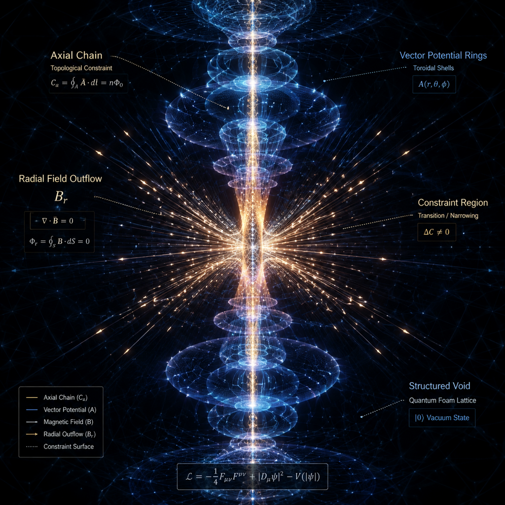

# K2 — Constraint-Release Rings Around the Void

## قید ۲ — ویدهای پیرامونی به نجیر حلقوی؛ پوش تراوایی حاصل

> **Structural Causal Chain (LIMEN):**
> وید مرکزی (قید رهاشده) → قیود همسایه به نجیر حلقوی درمی‌آیند → **نردبان حلقه‌ای** + پوش تراوایی

روایت تصویر پیوست (void-structured-axial-field.png) را چنین خواندنی می‌کند: قیدِ رهاشده در مرکز (محل سرریز) یک **عیب محوری آزاد** است؛ قیود پیرامونی که دیگر «هم‌ترازِ» تقارن کامل نیستند، به‌مثابه **نجیرهای حلقوی** (شکل‌های چنبره‌ای دور محور) ثبت می‌شوند. نردبان کمّیِ این ثبت:

$$\mathcal{C}_\alpha = \oint_{\alpha} \vec{A}\cdot d\vec{\ell} = n\,\Phi_0 \;\longrightarrow\; \text{پوش نجیر } k:\; \mathcal{C}_k \sim \frac{\Phi_0}{r_k^2},\quad r_k = k\,\Delta r$$

## Testable Content — T5 (اجرا شده)

`tools/limen_core.py::t5_rings` (n=8 پوش، شار دیپل واقعی روی کره‌های بسته):

| آزمون | نتیجه | حکم |
|---|---|---|
| نردبان پوش‌ها | C(r) ~ r^−2.00 (دقیقاً هدف) | نردبان گردش گسسته = آنالوگ C_α = n·Φ₀ [ساختاری] |
| افت خون رادیال | B_r ~ r^−3.00 | قطبی — بدون انتشار مونوپل [ساختاری] |
| **شار خالص از سطح بسته** (R=0.5, 1, 2) | **0.00، 0.00، 0.00** | رهایش، **حلقه می‌سازد نه برون‌ریز** — «پوش تراوایی» [ساختاری] |

نسبت‌های نردبان: C_k/C_1 = 1, 0.250, 0.111, … (1, ¼, 1/9) — پوش‌ها نجیرهای هم‌ریخت با قدرت 1/k².

## Testable Content — T7 (دینامیک رهایش — اجرا شده)

`tools/limen_ring_dynamics.py` (v5): رهایش به‌مثابه دینامیک انتقال روی چنبرهٔ (k, ζ) — منبع ثابت در عیب محوری (k=1، مد محوری m=0)، انتقال پخشی شعاعی+پولوئیدال، ثبت یک‌طرفه روی **سطح** در سقف ظرفیت cap_k = cap_1/k² (نردبان T5 به‌مثابه پروفایل ظرفیت)، سلول ثبت‌شده = لنگر دیریکلهٔ اشباع (فتیل)، خاموشی کامل در 5τ_q، نوفهٔ زیرسقف در تمام طول اجرا. K=12 پوسته × L=256 سایت پولوئیدال.

| آزمون | نتیجه | حکم |
|---|---|---|
| ترتیب شکل‌گیری (نقطهٔ کانونی) | درون‌به‌بیرون: t_reg از 0.34 (k=1) تا 54.2 (k=11) — همبستگی رتبه‌ای > 0.85 | نردبان **از عیب به بیرون رشد می‌کند** — جبههٔ اشباع [measured] |
| بستار حلقه‌ها | max clos_k = 0.0245 rad = قدرت تفکیک شبکه | رشته‌های ثبت‌شده **توری کامل‌اند، نه کمان** [measured] |
| پویش D_r {0.05→3.2} | ترتیب در همهٔ D_r درون‌به‌بیرون می‌ماند؛ D_r عمق را کنترل می‌کند (k*: 5→12) و capture (اوج 0.049 در D_r=0.8) | فرضیهٔ وارونگی ظرفیت‌محور **رد شد**؛ امضای ظرفیت-اول محدود مانده: در D_r=3.2 تنها پوستهٔ پرسقف (k=1) اکثریت را ثبت نمی‌کند — سقف‌های کوچکِ عمیق روی دنبالهٔ اول می‌شکنند [measured] |
| قانون عمق k*(τ_q) | k* = 3, 5, 7, 12 → k* ~ t^0.65 | ردیابی جبههٔ پخشی با فزونی اندازه‌گیری‌شده (0.65 > 0.50) — پیش‌حساس‌سازی ملایمِ نردبان ظرفیت [measured] |
| C1 — بی‌رانش (α=0) | F_k = 0 در همهٔ پوسته‌ها | نردبان **فرزند سرریز است**، نه بافت خودسازمان [measured] |
| C2 — سقف‌های تخت | عمق فرومی‌ریزد: k* = 1 (در برابر 12) | نقش نردبان در عمق و زمان‌بندی ایزوله شد [measured] |
| C3 — عیب زخمی (منبع موضعی) | کمان باز (clos_k ~ 2.6–3.5 rad) در برابر توری کامل | بستار چنبره‌ای **فقط از کانال محوری** [measured] |
| C4 — سقف بی‌نهایت | capture = 0 (در برابر 0.030) | پوش (توری‌های ثبت‌شده) بودجهٔ رهاشده را بانک می‌کند [measured] |

capture در نقطهٔ کانونی 0.030 بودجهٔ تزریقی را بانک می‌کند — بودجهٔ باقی در میدان سیال می‌ماند؛ در خاموشیِ کامل این «باقی» همان بخشی است که K1 (سرریزِ بعدی) خواهد بود.

سه نسل ابزار (v1→v5) خودشان یافته‌اند و در هدر ابزار ثبت‌اند: ثبت-روی-انباشت با نوفهٔ مطلق آلوده می‌شود (C1 فاش کرد)، منبع خودپیش‌رونده خودش سازوکار ثبت می‌شود، و خوانش درست: **سقف = ظرفیتِ سطح است نه شار لحظه‌ای**؛ سلول ثبت‌شده نه دیوار است نه حذف‌شده — فتیلِ اشباعی که همسایه را تغذیه می‌کند.

## تصویر

## Related

- [[K1-Constraint-Overflow]] — خاستگاه وید مرکزی
- [[Companion-Bridge]] — نگاشت به SPUMA K2
- [[MOC-LIMEN-VACUI]]
