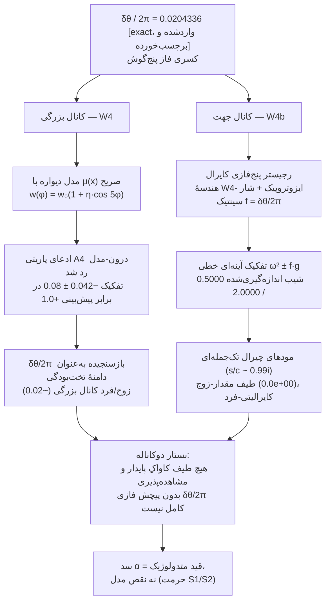

# خانوادهٔ SPUMA–LIMEN–Vault–CADENCE — خانه

> **یک پروتکل، هشت مخزن.** هر هشت مخزن همان پروتکل هم‌تراز را اجرا می‌کنند (خانهٔ کانونی: [LIMEN-VACUI `08_Protocol/Aligned-Protocol`](https://github.com/adelgachkar/LIMEN-VACUI)). این ویکی در ورودیِ خانواده است: نقشهٔ بستار، جدول نسخه‌ها + DOI، و نمایهٔ fa/↔EN.

---

## ۱. خانواده در یک نگاه

| مخزن | نقش | نسخه | DOI مفهومی (همیشه آخرین) | چینش زبانی |
|---|---|---|---|---|
| **[LIMEN-VACUI](https://github.com/adelgachkar/LIMEN-VACUI)** | روایت پیشا-مرز؛ **خانهٔ کانونی پروتکل هم‌تراز**، رجیستر دو-قلمرو، و بستار تبیینی | v0.12.3 | [10.5281/zenodo.23006050](https://doi.org/10.5281/zenodo.23006050) | ریشه EN + **آینهٔ کامل fa/** |
| **[SPUMA-VACUI](https://github.com/adelgachkar/SPUMA-VACUI)** | روایت فوم خلأ؛ فیزیک فریز-اوت K1، هارمونیک‌های کاواک، پل همتا | v0.4.10 | [10.5281/zenodo.23006052](https://doi.org/10.5281/zenodo.23006052) | فقط EN |
| **[Emergence-SDF-Vault](https://github.com/adelgachkar/Emergence-SDF-Vault)** | مدل ظهور هندسهٔ گسسته؛ منبع ثابت‌های مشتق (κ_hop، τ_d، δθ) | v30.3.11 | [10.5281/zenodo.22834778](https://doi.org/10.5281/zenodo.22834778) | فقط EN |
| **[CADENCE-SDF](https://github.com/adelgachkar/CADENCE-SDF)** | ارائهٔ مهندسی اصل/CAD؛ حکمرانی fail-closed (هنجار E2) | v3.6.9 | [10.5281/zenodo.23006055](https://doi.org/10.5281/zenodo.23006055) | فقط EN |
| **[CRG-Flux](https://github.com/adelgachkar/CRG-Flux)** | چارچوب فlexوالکتریک تا کیهان‌شناختیِ میان-مقیاس؛ نمونهٔ ماده‌چگال | v0.1.0 | [10.5281/zenodo.23271286](https://doi.org/10.5281/zenodo.23271286) | فقط EN |
| **[VMC-QF](https://github.com/adelgachkar/VMC-QF)** | فوم کوانتومی ریزحفره‌ای خلأ؛ زمان کادنس و سولیتون‌های توپولوژیک | v0.3.1 | [10.5281/zenodo.23094459](https://doi.org/10.5281/zenodo.23094459) | فقط EN |
| **[SDF-VLT-Gravity-Dynamics](https://github.com/adelgachkar/SDF-VLT-Gravity-Dynamics)** | دینامیک گرانش خلأ/شبکه؛ گرانش فشار-مرزی و زنجیرهٔ کانونی | v3.4.3 | [10.5281/zenodo.22412460](https://doi.org/10.5281/zenodo.22412460) | فقط EN |
| **[SDF_Lattice_Master](https://github.com/adelgachkar/SDF_Lattice_Master)** | موتور اجرایی پایتون: ۱۲ ماژول نود (بر tầm/گشتاور بری، پمپ پریستالتیک، علیت تأخیری، جفت‌شدگی حفره، تنش، ابرسلول)؛ ۶۰ تست سبز؛ غربالگری α = ۱۳۷٫۰۳۲ | v0.3.4 | [10.5281/zenodo.23271142](https://doi.org/10.5281/zenodo.23271142) | فقط EN |

*نسخه‌ها تا ۲۰۲۶-۱۰-۱۰. نخستین deposit زنودوی VMC-QF به‌صورت دستی منتشر شد (DOI نسخه: [10.5281/zenodo.23094460](https://doi.org/10.5281/zenodo.23094460)، v0.3.1) و اکنون ششمین رکورد مفهومی خانواده است؛ نخستین deposit CRG-Flux در ۲۰۲۶-۱۰-۱۰ منتشر شد (DOI مفهومی ۱۰٫۵۲۸۱/zenodo.۲۳۲۷۱۲۸۶، v0.1.0) — **اکنون هر عضو خانواده DOI مفهومی زنده دارد**. نخستین deposit SDF_Lattice_Master نیز با API زنودو منتشر شد (DOI مفهومی ۱۰٫۵۲۸۱/zenodo.۲۳۲۷۱۱۴۲، v0.3.4) — عضو هشتم و همتای اجرایی خانواده. جدول نسخه‌ها آینهٔ README §2b مخزن Vault است.*

---

## ۲. بستار دوکانالهٔ گرهٔ پنج‌گوش

آخرین نتیجهٔ تلفیقی خانواده: کسر فاز **δθ = 7.356103°** گرهٔ پنج‌گوش (δθ/2π = **0.0204336**، واردشده-و-برچسب‌خورده از Vault؛ وضعیت سمت-طبیعت **F3**) از **دو کانال مستقل درون-مدلی** بسته می‌شود — سند کامل: [LIMEN `10_Reference/Explanatory-Closure`](https://github.com/adelgachkar/LIMEN-VACUI/blob/main/10_Reference/Explanatory-Closure.md) (فا+EN).

**چه ادعا می‌شود — و چه نمی‌شود.** بستار پاسخِ «چرا پنج چهاروجهی؟» نیست؛ ضرورت درون-مدلی را ثبت می‌کند: *هیچ طیف کاواکِ پایدار و مشاهده‌پذیری بدون پیچش δθ/2π کامل نیست* — بزرگی‌اش از W4، پاریتی‌اش از W4b. سد α (عدم امکان اشتقاق از پیشا-مرز) به‌عنوان دارایی متدولوژیک ثبت شده، نه شکاف.

**مهاجرت اکنون ماشین‌خوان است (W4c، ۲۰۲۶-۰۹-۲۷):** مهاجرت S→W طبیعتی‌سوی ثابت‌های واردشده دیگر امید نیست — `tools/limen_w4c_f3_migration.py` چهار آزمون پذیرش را **پیش از رسیدن هر مجموعه‌دادهٔ هم‌ترازِ کامپانیون** در `tools/limen_w4c_f3_migration_ledger.json` منجمد می‌کند؛ مهاجرتِ آینده ویرایشِ قابل‌راستی‌آزماییِ رجیستری است که به لجرِ همان داده لنگر می‌خورد.

---

## ۳. وضعیت بانک رجیستر

خانهٔ کانونی: [LIMEN `08_Protocol/Two-Realm-Register`](https://github.com/adelgachkar/LIMEN-VACUI/blob/main/08_Protocol/Two-Realm-Register.md) (فا+EN، با جدول لحظه‌ای قفل‌ها).

| قلمرو | آیتم‌ها | وضعیت |
|---|---|---|
| **کار** | W1، W2، W3، W4، W4b، W5، W6، W7 | ✅ **۸ done — بانک کار به‌طور کامل اجرا شد** (W5 نسبت انرژی ۴٫۶ را بست: یک عملگر κ(g)، دو ساعت — هیچ مقیاس تازه‌ای نیست) |
| **کار** | W4c — دروازهٔ مهاجرت S→W سطر F3 | ✅ انجام شد: چهار آزمون پذیرش (D1 تفکیک / D1b کایرالیتی / D2 تخت‌بودگی / D3 توان عملگر) پیش از هر مجموعه‌داده در `_ledger.json` منجمدند؛ درون-سیلیکو گرهٔ پنج‌گوش هر چهار را می‌گذراند، کنترل ایزوتروپیک و تقلیدگرِ فقط-تفکیک با گیت نام‌برده رد می‌شوند [sim] |
| **حرمت** | S1، S2 | 🔒 دائمی — دست‌نخورده |
| **چارچوب** | F1، F2 (کارِ بانک‌شده) / F3 (revere) | 🔓 باز / 🔒 تا دادهٔ هم‌تراز — **دروازهٔ مهاجرت اکنون ماشین‌خوان است (W4c)** |

---

## ۴. نمایهٔ fa/ ↔ EN

| مخزن | EN | FA | یادداشت |
|---|---|---|---|
| LIMEN-VACUI | ریشه (کانونی) | [`fa/`](https://github.com/adelgachkar/LIMEN-VACUI/tree/main/fa) — آینهٔ کامل شامل پروتکل، رجیستر، بستار | `lang: en` / `lang: fa` در فرانت‌متر |
| SPUMA-VACUI | ریشه | — | نسخهٔ EN-اول |
| Emergence-SDF-Vault | ریشه | — | نسخهٔ EN-اول |
| CADENCE-SDF | ریشه | — | نسخهٔ EN-اول |
| SDF_Lattice_Master | ریشه | — | نسخهٔ EN-اول (v0.3.4، صفر فارسی) |

**قاعدهٔ آینه (LIMEN):** هر ویرایش کانونی به هر دو زبان در یک کامیت می‌نشیند؛ فیلد `lang` فرانت‌متر تعیین می‌کند کدام سمت برای QA کانونی است.

---

## ۵. لنگرهای پروتکل

- سه‌گانهٔ مولد: **قید (پتانسیل‌ساز) × سکوت (جازننده) × رخداد (جهت‌ساز)** → هنجارهای E0–E5.
- مستندسازی کتاب‌شناختی: نُه لنگر ([LIMEN `09_Literature_Grounding/`](https://github.com/adelgachkar/LIMEN-VACUI/tree/main/09_Literature_Grounding)) — اسپنسر-براون، لومان، لاکاتوس، تارسکی، کانت، راسل، گروتندیک، فاینمن، نوتر.
- واژگان نردبان مراتب: [Vault `01_Foundations/Rank-Ladder-Glossary`](https://github.com/adelgachkar/Emergence-SDF-Vault/blob/main/01_Foundations/Rank-Ladder-Glossary.md).
- ظهور به‌مثابه رخداد ثبت: [LIMEN `10_Reference/Emergence-Balance-Reference`](https://github.com/adelgachkar/LIMEN-VACUI/blob/main/10_Reference/Emergence-Balance-Reference.md) (فا+EN).

---

*این ویکی در گیت نسخه‌گذاری می‌شود (LIMEN-VACUI پوشهٔ `wiki/`). برچسب محتوا از رجیستر صداقت خانواده پیروی می‌کند: [exact] / [measured] / [structural] / [model]؛ فیزیک سمت-طبیعت با F3 برچسب‌خورده است.*
