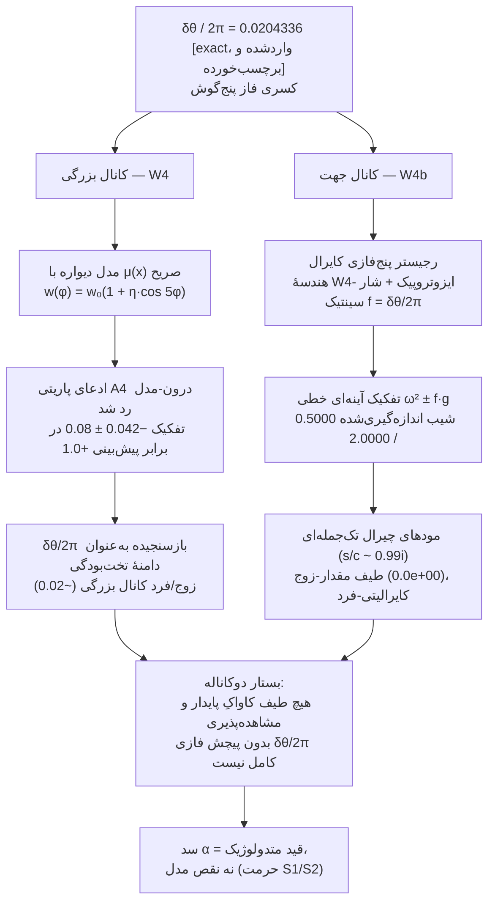

# خانوادهٔ SPUMA–LIMEN–Vault–CADENCE–CRG-Flux–VMC-QF — خانه

> **یک پروتکل، شش مخزن.** هر شش مخزن همان پروتکل هم‌تراز را اجرا می‌کنند (خانهٔ کانونی: [LIMEN-VACUI `08_Protocol/Aligned-Protocol`](https://github.com/adelgachkar/LIMEN-VACUI)). این ویکی در ورودیِ خانواده است: نقشهٔ بستار، جدول نسخه‌ها، و نمایهٔ fa/↔EN.

---

## ۱. خانواده در یک نگاه

| مخزن | نقش | نسخه | چینش زبانی | زنودو (concept-DOI) |
|---|---|---|---|---|
| **[LIMEN-VACUI](https://github.com/adelgachkar/LIMEN-VACUI)** | روایت پیشا-مرز؛ **خانهٔ کانونی پروتکل هم‌تراز**، رجیستر دو-قلمرو، و بستار تبیینی | v0.12.3 | ریشه EN + **آینهٔ کامل fa/** |  |
| **[SPUMA-VACUI](https://github.com/adelgachkar/SPUMA-VACUI)** | روایت فوم خلأ؛ فیزیک فریز-اوت K1، هارمونیک‌های کاواک، پل همتا | v0.4.10 | فقط EN |  |
| **[Emergence-SDF-Vault](https://github.com/adelgachkar/Emergence-SDF-Vault)** | مدل ظهور هندسهٔ گسسته؛ منبع ثابت‌های مشتق (κ_hop، τ_d، δθ) | v30.3.11 | فقط EN |  |
| **[CADENCE-SDF](https://github.com/adelgachkar/CADENCE-SDF)** | ارائهٔ مهندسی اصل/CAD؛ حکمرانی fail-closed (هنجار E2) | v3.6.9 | فقط EN |  |
| **[CRG-Flux](https://github.com/adelgachkar/CRG-Flux)** | والت فکسوالکتریک→کیهان‌شناختی چندمقیاسی؛ پل فیزیک آزمایشگاهی خانواده (فلکسوالکتریک گرافن خمیده)؛ منبع آزمون تغذیهٔ خارجی W8 | v0.1.0 | فقط EN | *(در انتظار — اولین deposit هنوز پابلیش نشده)* |
| **[VMC-QF](https://github.com/adelgachkar/VMC-QF)** | روایت میکروکاواک کوانتومی: بستر کوانتومی بدون‌منیفلد (فضای هیلبرت متناهی‌بعد به‌ازای هر گره، زمان کادانسی گسسته)، سالیتون توپولوژیک روی همان هندسهٔ ۵-حول-۱ (δθ واردشده-و-برچسب‌خورده از Vault)؛ **رکوردهای Vault-11/12/13/14**: اجرای دقیق CPTP ۶۴بعدی (نسبت‌های 2.042 / 2.083 در γ=0.1)، نقشهٔ فرسایش R(γ)، باتری مقیاس، و باتری بازخورد غیرخطی که آخرین معیار باز را بست | v0.2.0 | فقط EN | *(در انتظار — وب‌هوک هنوز فعال نشده)* |

*نسخه‌ها تا ۲۰۲۶-۰۹-۳۰. جدول نسخه‌ها آینهٔ README §2b مخزن Vault است. هر concept-DOI همیشه به آخرین نسخهٔ منتشرشده می‌رود؛ DOI تک‌تک نسخه‌ها در §6 آمده است. VMC-QF عمومی و منتشرشده در v0.2.0 است (Releaseهای v0.1.0 + v0.2.0؛ ۸ کامیت) — با فعال‌سازی وب‌هوک زنودو به زنجیرهٔ DOI می‌پیوندد.*

**وضعیت نشریاتی (SPUMA-VACUI):** دستنوشتهٔ *"SPUMA-VACUI: Emergence of Near-Homogeneous Polarized Cavities in a Vacuum-Foam Substrate via Dual Boundary Constraints"* در ۲۰۲۶-۰۹-۲۸ به *International Journal of Theoretical Physics* (Springer) ارسال شد؛ پس از یک دور چک فنی (تک‌ایراد: بای‌لاین نویسنده)، در **۲۰۲۶-۰۹-۲۹ ساعت ۱۷:۰۵** دوباره ارسال شد و اکنون در مرحلهٔ چک فنی است — شرح کامل زمان‌بندی در نخستین **Publication-Register** خانواده (`SPUMA-VACUI/00_MOC/Publication-Register.md`). هیچ پذیرش یا تأییدیه‌ای ادعا نمی‌شود.

---

## ۲. بستار دوکانالهٔ گرهٔ پنج‌گوش

آخرین نتیجهٔ تلفیقی خانواده: کسر فاز **δθ = 7.356103°** گرهٔ پنج‌گوش (δθ/2π = **0.0204336**، واردشده-و-برچسب‌خورده از Vault؛ وضعیت سمت-طبیعت **F3**) از **دو کانال مستقل درون-مدلی** بسته می‌شود — سند کامل: [LIMEN `10_Reference/Explanatory-Closure`](https://github.com/adelgachkar/LIMEN-VACUI/blob/main/10_Reference/Explanatory-Closure.md) (فا+EN).

**چه ادعا می‌شود — و چه نمی‌شود.** بستار پاسخِ «چرا پنج چهاروجهی؟» نیست؛ ضرورت درون-مدلی را ثبت می‌کند: *هیچ طیف کاواکِ پایدار و مشاهده‌پذیری بدون پیچش δθ/2π کامل نیست* — بزرگی‌اش از W4، پاریتی‌اش از W4b. سد α (عدم امکان اشتقاق از پیشا-مرز) به‌عنوان دارایی متدولوژیک ثبت شده، نه شکاف.

**مهاجرت اکنون ماشین‌خوان است (W4c، ۲۰۲۶-۰۹-۲۷):** مهاجرت S→W طبیعتی‌سوی ثابت‌های واردشده دیگر امید نیست — `tools/limen_w4c_f3_migration.py` چهار آزمون پذیرش را **پیش از رسیدن هر مجموعه‌دادهٔ هم‌ترازِ کامپانیون** در `tools/limen_w4c_f3_migration_ledger.json` منجمد می‌کند؛ مهاجرتِ آینده ویرایشِ قابل‌راستی‌آزماییِ رجیستری است که به لجرِ همان داده لنگر می‌خورد.

---

## ۳. وضعیت بانک رجیستر

خانهٔ کانونی: [LIMEN `08_Protocol/Two-Realm-Register`](https://github.com/adelgachkar/LIMEN-VACUI/blob/main/08_Protocol/Two-Realm-Register.md) (فا+EN، با جدول لحظه‌ای قفل‌ها).

| قلمرو | آیتم‌ها | وضعیت |
|---|---|---|
| **کار** | W1، W2، W3، W4، W4b، W5، W6، W7 | ✅ **۸ done** (W5 نسبت انرژی ۴٫۶ را بست: یک عملگر κ(g)، دو ساعت — هیچ مقیاس تازه‌ای نیست) |
| **کار** | W4c — دروازهٔ مهاجرت S→W سطر F3 | ✅ انجام شد: چهار آزمون پذیرش (D1 تفکیک / D1b کایرالیتی / D2 تخت‌بودگی / D3 توان عملگر) پیش از هر مجموعه‌داده در `_ledger.json` منجمدند؛ درون-سیلیکو گرهٔ پنج‌گوش هر چهار را می‌گذراند، کنترل ایزوتروپیک و تقلیدگرِ فقط-تفکیک با گیت نام‌برده رد می‌شوند [sim] |
| **کار** | W8 — تغذیهٔ خارجی: شاخه‌های دوبعدی CRG → مجراهای رجیستر یکپارچه (OQ-C4-2، از CRG-Flux) | ✅ انجام شد ۲۰۲۶-۰۹-۲۸: دو شاخهٔ پایدار **دو مجرا را تقسیم می‌کنند** — شاخهٔ ذوب‌شده → فریز-اوت SPUMA (B)، شاخهٔ هستهٔ منجمد → ثبت LIMEN (A)؛ ۰/۹ وارونگی کالیبراسیون؛ دوبعدی‌شدگی بازسنجیده ۰٫۳۷٪ (E4: میانگین ۱٫۲۵ تعادل پایدار). **بانک ۱۰ done / ۰ pending.** |
| **کار (رجیستر VMC-QF)** | VMC-QF-Vault-11 — اجرای دقیق CPTP ۶۴بعدی پروتکل D05، شامل آزمون تعیین‌کنندهٔ معوق فاز-لبهٔ D04 | ✅ انجام شد ۲۰۲۶-۰۹-۳۰: نسبت عمر به S-01 = **2.042** (دیتیون سایت) / **2.083** (شار فاز-لبه) در γ=0.1 — معیار «نقص، عمر همدوسی را حداقل دو برابر می‌کند» **درون-سیلیکو تأیید شد**؛ block==full تا ~۱۰⁻¹³ راستی‌آزمایی شد؛ تقیید تک-گاما ثبت شد [sim] |
| **کار (رجیستر VMC-QF)** | VMC-QF-Vault-12 — نقشهٔ پایداری نسبی R(γ) = τ_life(نقص)/τ_life(صفر) | ✅ انجام شد ۲۰۲۶-۰۹-۳۰: R به‌طور یکنوا از ≈2.1 به 1.65 فرسایش می‌یابد در γ ∈ [0.01, 0.5]؛ معیار ×۲ تا γ ≈ 0.3 زنده می‌ماند؛ مدل توانیِ فروپاشی ابطال شد؛ سه برآوردگر هم‌نظر [sim] |
| **کار (رجیستر VMC-QF)** | VMC-QF-Vault-13 — چهار معیار ابطال سطح-مقیاس S04 | ✅ انجام شد ۲۰۲۶-۰۹-۳۰: علیت v_ratio = 0.40 ✓؛ پسماند بیلان A03 درون δ_tol ✓؛ پرسکولاسیون ρ_c = 0.4075 ✓ (E4: مقدار بی‌منبع 0.382 بازنشسته شد)؛ تقویت عمر **باز-در-انتظار-عملگر-بازخورد**؛ پین‌شدن منفی در دامنهٔ موتور [sim] |
| **کار (رجیستر VMC-QF)** | VMC-QF-Vault-14 — بستن معیار ۲ با عملگر بازخورد ثبت‌شدهٔ D01 §8 | ✅ انجام شد ۲۰۲۶-۰۹-۳۰: R_τ > 1 در **هر دو** قرارداد dt پابرجا؛ تقویت واقعی ماکرو χ_gen = **2.0 J**؛ سود نزدیک آستانه مخرج‌رانده (فروپاشی میکرو در χ_collapse = 0.14)؛ **تقیید E4:** پایهٔ Vault-13 یعنی R_τ(β=0) = 0.965 با دوفازی تکه‌ای درشت‌دانه ×2.14 متورم شده بود — پایهٔ همگرا ≈ 2.06 (تاریخ پاک نشد) [sim] |
| **حرمت** | S1، S2 | 🔒 دائمی — دست‌نخورده |
| **چارچوب** | F1، F2 (کارِ بانک‌شده) / F3 (revere) | 🔓 باز / 🔒 تا دادهٔ هم‌تراز — **دروازهٔ مهاجرت اکنون ماشین‌خوان است (W4c)** |

---

## ۴. نمایهٔ fa/ ↔ EN

| مخزن | EN | FA | یادداشت |
|---|---|---|---|
| LIMEN-VACUI | ریشه (کانونی) | [`fa/`](https://github.com/adelgachkar/LIMEN-VACUI/tree/main/fa) — آینهٔ کامل شامل پروتکل، رجیستر، بستار | `lang: en` / `lang: fa` در فرانت‌متر |
| SPUMA-VACUI | ریشه | — | نسخهٔ EN-اول |
| Emergence-SDF-Vault | ریشه | — | نسخهٔ EN-اول |
| CADENCE-SDF | ریشه | — | نسخهٔ EN-اول |
| CRG-Flux | ریشه | — | نسخهٔ EN-اول |
| VMC-QF | ریشه (۱۴ نوت + 00_MOC/Index) | — | نسخهٔ EN-اول |

**قاعدهٔ آینه (LIMEN):** هر ویرایش کانونی به هر دو زبان در یک کامیت می‌نشیند؛ فیلد `lang` فرانت‌متر تعیین می‌کند کدام سمت برای QA کانونی است.

---

## ۵. لنگرهای پروتکل

- سه‌گانهٔ مولد: **قید (پتانسیل‌ساز) × سکوت (جازننده) × رخداد (جهت‌ساز)** → هنجارهای E0–E5.
- مستندسازی کتاب‌شناختی: نُه لنگر ([LIMEN `09_Literature_Grounding/`](https://github.com/adelgachkar/LIMEN-VACUI/tree/main/09_Literature_Grounding)) — اسپنسر-براون، لومان، لاکاتوس، تارسکی، کانت، راسل، گروتندیک، فاینمن، نوتر.
- واژگان نردبان مراتب: [Vault `01_Foundations/Rank-Ladder-Glossary`](https://github.com/adelgachkar/Emergence-SDF-Vault/blob/main/01_Foundations/Rank-Ladder-Glossary.md).
- ظهور به‌مثابه رخداد ثبت: [LIMEN `10_Reference/Emergence-Balance-Reference`](https://github.com/adelgachkar/LIMEN-VACUI/blob/main/10_Reference/Emergence-Balance-Reference.md) (فا+EN).
- وضعیت پروتکل: [LIMEN `10_Reference/Bank-Complete`](https://github.com/adelgachkar/LIMEN-VACUI/blob/main/10_Reference/Bank-Complete.md) (فا+EN) — هشت آزمون اجراشده، چهار تصحیح E4، اقلام باز به‌عمد.
- قرارداد واحد f_c (سراسر خانواده): **f_c = κ[rad/s]/π** (Vault، `Optical-Stepping-Synthetic-Gauge` §2.2.2)؛ خوانش κ[Hz]/π دقیقاً 2π تفاوت دارد و هیچ عدد ثبت‌شده‌ای را بازتولید نمی‌کند؛ اتحاد exact **f_c·τ_d = 1/2**.

---

## ۶. استناد به خانواده

زنجیرهٔ استناد بسته و خودکار است: **کامیت → تگ → GitHub Release → deposit زنودو (باز، MIT، ORCID نویسنده 0009-0006-7713-6004) → DOI نسخه‌دار.** هر Release آینده DOI نسخهٔ خودش را بدون هیچ گام دستی صادر می‌کند.

| مخزن | concept-DOI (همیشه آخرین نسخه) | DOI نسخهٔ فعلاً منتشرشده |
|---|---|---|
| LIMEN-VACUI | [10.5281/zenodo.23006050](https://doi.org/10.5281/zenodo.23006050) | [10.5281/zenodo.23017333](https://doi.org/10.5281/zenodo.23017333) (v0.12.3) |
| SPUMA-VACUI | [10.5281/zenodo.23006052](https://doi.org/10.5281/zenodo.23006052) | [10.5281/zenodo.23017334](https://doi.org/10.5281/zenodo.23017334) (v0.4.10) |
| Emergence-SDF-Vault | [10.5281/zenodo.22834778](https://doi.org/10.5281/zenodo.22834778) | [10.5281/zenodo.23017337](https://doi.org/10.5281/zenodo.23017337) (v30.3.11) |
| CADENCE-SDF | [10.5281/zenodo.23006055](https://doi.org/10.5281/zenodo.23006055) | [10.5281/zenodo.23017338](https://doi.org/10.5281/zenodo.23017338) (v3.6.9) |
| CRG-Flux | — (در انتظار) | — (در انتظار — webhook زنودو پس از آخرین همگام‌سازی فعال شد؛ اولین deposit در Release بعدی DOI می‌گیرد) |
| VMC-QF | — (در انتظار) | — (در انتظار — وب‌هوک زنودو هنوز برای مخزن فعال نشده؛ پس از فعال‌سازی، هر Release **جدید** یک deposit می‌سازد — Release بعدیِ برنامه‌ریزی‌شده زنجیره را آغاز می‌کند؛ پشگیریبانی v0.1.0/v0.2.0 توسط integration تضمین نمی‌شود) |

*یادداشت صداقت E4: DOI نسخه در هر سطر به رکورد منتشرشدهٔ فعلی لنگر خورده (v0.12.3 / v0.4.10 / v30.3.11 / v3.6.9 — همگی منتشرشدهٔ ۲۰۲۶-۰۹-۲۸ با ORCID راستی‌آزمایی‌شدهٔ نویسنده 0009-0006-7713-6004) و در CITATION.cff و README هر مخزن ثبت شده است. CRG-Flux و VMC-QF هنوز deposit ندارند — هیچ DOIای برای هیچ‌کدام ادعا نمی‌شود. مگر نسخهٔ منجمد مشخصی لازم داشته باشید، concept-DOI را استناد کنید.*

---

## ۷. زنجیرهٔ ابطال VMC-QF (عضو تازهٔ خانواده، بسته‌شده)

عضو ششم زنجیرهٔ ابطال کامل خود را در ۲۰۲۶-۰۹-۳۰ بست — هر معیار ثبت‌شده حالا مقدار اندازه‌گیری‌شده‌ای زیر یک قرارداد موتور صریح دارد (موتور خطی: Vault-13؛ موتور + عملگر بازخورد D01 §8: Vault-14):

| سطح زنجیره | رکورد | نتیجه |
|---|---|---|
| اصل / هندسه | G01 (بازسازی) | δθ = 2π − 5·arccos(1/3) = 7.356103° اشتقاق و ماشین-راستی‌آزمایی شد؛ فرمول پیشینِ پیش‌نویس (arccos(7/8)) از نظر حسابی غلط بود و به‌عنوان تصحیح ثبت شد |
| شبیه‌سازی | Vault-11 / Vault-12 | تأیید «نقص ×۲» در γ=0.1 (2.042 / 2.083)؛ نقشهٔ فرسایش R(γ) — ×۲ تا γ ≈ 0.3 زنده می‌ماند |
| مقیاس | Vault-13 / Vault-14 | علیت ✓، بیلان ✓، پرسکولاسیون ρ_c = 0.4075 ✓؛ معیار ۲ بسته شد: تقویت واقعی ماکرو χ_gen = 2.0 J (dt-robust)؛ پایهٔ Vault-13 (0.965) تقیید E4 قرارداد-dt دارد (همگرا ≈ 2.06) |

داده‌ها و اسکریپت‌ها در [`VMC-QF/_data/`](https://github.com/adelgachkar/VMC-QF/tree/main/_data) با CSV و شکل و لاگ کامل به‌ازای هر رکورد.

---

*این ویکی در گیت نسخه‌گذاری می‌شود (LIMEN-VACUI پوشهٔ `wiki/`). برچسب محتوا از رجیستر صداقت خانواده پیروی می‌کند: [exact] / [measured] / [structural] / [model]؛ فیزیک سمت-طبیعت با F3 برچسب‌خورده است.*
