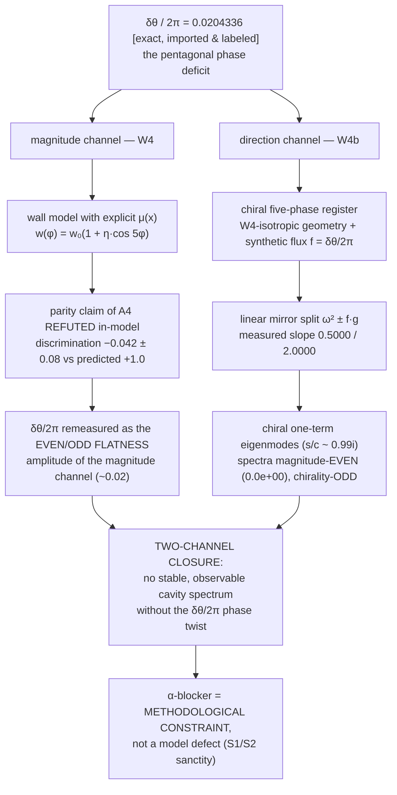

# SPUMA–LIMEN–Vault–CADENCE Family — Home

> **One protocol, eight repositories.** All eight repos execute the same Aligned Protocol (canonical home: [LIMEN-VACUI `08_Protocol/Aligned-Protocol`](https://github.com/adelgachkar/LIMEN-VACUI)). This wiki is the family's front door: the closure map, the version+DOI table, and the fa/↔EN index.

---

## 1. The family at a glance

| Repository | Role | Version | Concept DOI (always latest) | Language layout |
|---|---|---|---|---|
| **[LIMEN-VACUI](https://github.com/adelgachkar/LIMEN-VACUI)** | pre-boundary narrative; **canonical home of the Aligned Protocol**, the Two-Realm Register, and the Explanatory Closure | v0.12.3 | [10.5281/zenodo.23006050](https://doi.org/10.5281/zenodo.23006050) | EN root + **fa/ full mirror** |
| **[SPUMA-VACUI](https://github.com/adelgachkar/SPUMA-VACUI)** | vacuum-foam narrative; K1 freeze-out physics, cavity harmonics, Companion-Bridge | v0.4.10 | [10.5281/zenodo.23006052](https://doi.org/10.5281/zenodo.23006052) | EN only |
| **[Emergence-SDF-Vault](https://github.com/adelgachkar/Emergence-SDF-Vault)** | discrete-geometry emergence model; the source of derived constants (κ_hop, τ_d, δθ) | v30.3.11 | [10.5281/zenodo.22834778](https://doi.org/10.5281/zenodo.22834778) | EN only |
| **[CADENCE-SDF](https://github.com/adelgachkar/CADENCE-SDF)** | engineering-facing axiom/CAD presentation; fail-closed governance (norm E2) | v3.6.9 | [10.5281/zenodo.23006055](https://doi.org/10.5281/zenodo.23006055) | EN only |
| **[CRG-Flux](https://github.com/adelgachkar/CRG-Flux)** | cross-scale flexoelectric-to-cosmological framework; condensed-matter archetype | v0.1.0 | [10.5281/zenodo.23271286](https://doi.org/10.5281/zenodo.23271286) | EN only |
| **[VMC-QF](https://github.com/adelgachkar/VMC-QF)** | vacuum microcavity quantum foam; cadence time & topological solitons | v0.3.1 | [10.5281/zenodo.23094459](https://doi.org/10.5281/zenodo.23094459) | EN only |
| **[SDF-VLT-Gravity-Dynamics](https://github.com/adelgachkar/SDF-VLT-Gravity-Dynamics)** | void/lattice gravity dynamics; boundary-pressure gravity and the canonical chain | v3.4.3 | [10.5281/zenodo.22412460](https://doi.org/10.5281/zenodo.22412460) | EN only |
| **[SDF_Lattice_Master](https://github.com/adelgachkar/SDF_Lattice_Master)** | Python execution engine: 12 node modules (Berry dynamics/torque, peristaltic pump, delayed causality, cavity coupling, strain, supercell); 60 tests all green; α-screening reproduces 137.032 | v0.3.4 | [10.5281/zenodo.23271142](https://doi.org/10.5281/zenodo.23271142) | EN only |

*Versions as of 2026-10-10. VMC-QF's first Zenodo deposit was published manually (version DOI [10.5281/zenodo.23094460](https://doi.org/10.5281/zenodo.23094460), v0.3.1) and is now the family's sixth concept record; CRG-Flux's first deposit was published on 2026-10-10 (concept DOI 10.5281/zenodo.23271286, v0.1.0) — **every family member now holds a live concept DOI**. SDF_Lattice_Master's first deposit was also published manually via the Zenodo API (concept DOI 10.5281/zenodo.23271142, v0.3.4) — the family's eighth member and its executable counterpart. The version table is mirrored in Vault README §2b.*

---

## 2. The two-channel closure of the pentagonal node

The family's latest consolidated result: the pentagonal node's phase deficit **δθ = 7.356103°** (δθ/2π = **0.0204336**, imported-and-labeled from Vault; nature-side status **F3**) closes through **two independent in-model channels** — full document: [LIMEN `10_Reference/Explanatory-Closure`](https://github.com/adelgachkar/LIMEN-VACUI/blob/main/10_Reference/Explanatory-Closure.md) (FA+EN).

**What is claimed — and what is not.** The closure does *not* answer "why five tetrahedra?"; it establishes the in-model necessity: *no stable, observable cavity spectrum is complete without the δθ/2π twist* — its magnitude via W4, its parity via W4b. The α-blocker (no derivation from the pre-boundary) is recorded as a methodological asset, not a gap.

**The migration is now machine-readable (W4c, 2026-09-27):** the nature-side S→W migration of the imported constants is no longer a hope — `tools/limen_w4c_f3_migration.py` pre-commits the four acceptance checks in `tools/limen_w4c_f3_migration_ledger.json` **before** any aligned companion dataset arrives; a future migration is a checkable register edit anchored to that dataset's ledger.

---

## 3. Register bank status

Canonical home: [LIMEN `08_Protocol/Two-Realm-Register`](https://github.com/adelgachkar/LIMEN-VACUI/blob/main/08_Protocol/Two-Realm-Register.md) (FA+EN, with a live lock-snapshot table).

| Realm | Items | Status |
|---|---|---|
| **Work** | W1, W2, W3, W4, W4b, W5, W6, W7 | ✅ **8 done — the work bank is FULLY executed** (W5 closed the 4.6 energy-scale ratio: one operator κ(g), two clocks — no new scale) |
| **Work** | W4c — the F3 S→W migration gate | ✅ done: four acceptance checks (D1 split / D1b chirality / D2 flatness / D3 operator power) pre-committed in `_ledger.json` before any dataset; in-silico the pentagonal node passes all four, the isotropic control and a split-only mimic fail with named gates [sim] |
| **Sanctity** | S1, S2 | 🔒 permanent — untouched |
| **Framework** | F1, F2 (banked work) / F3 (revere) | 🔓 open / 🔒 until aligned data — **the migration gate is now machine-readable (W4c)** |

---

## 4. fa/ ↔ EN index

| Repository | EN | FA | Notes |
|---|---|---|---|
| LIMEN-VACUI | root (canonical) | [`fa/`](https://github.com/adelgachkar/LIMEN-VACUI/tree/main/fa) — full mirror incl. Protocol, Register, Closure | `lang: en` / `lang: fa` in frontmatter |
| SPUMA-VACUI | root | — | EN-first edition |
| Emergence-SDF-Vault | root | — | EN-first edition |
| CADENCE-SDF | root | — | EN-first edition |
| CRG-Flux | root | — | EN-first edition |
| VMC-QF | root | — | EN-first edition |
| SDF-VLT-Gravity-Dynamics | root | — | EN-first edition (v3.4.3 monolingual pass) |
| SDF_Lattice_Master | root | — | EN-first edition (v0.3.4, zero Persian) |

**Mirror rule (LIMEN):** every canonical edit lands in both languages in one commit; the frontmatter `lang` field decides the canonical side for QA.

---

## 5. Protocol anchors

- The generative triad: **constraint (potential-maker) × silence (licensor) × event (direction-maker)** → norms E0–E5.
- Literature grounding: nine anchors ([LIMEN `09_Literature_Grounding/`](https://github.com/adelgachkar/LIMEN-VACUI/tree/main/09_Literature_Grounding)) — Spencer-Brown, Luhmann, Lakatos, Tarski, Kant, Russell, Grothendieck, Feynman, Noether.
- Rank-ladder vocabulary: [Vault `01_Foundations/Rank-Ladder-Glossary`](https://github.com/adelgachkar/Emergence-SDF-Vault/blob/main/01_Foundations/Rank-Ladder-Glossary.md).
- Emergence as a registry event: [LIMEN `10_Reference/Emergence-Balance-Reference`](https://github.com/adelgachkar/LIMEN-VACUI/blob/main/10_Reference/Emergence-Balance-Reference.md) (FA+EN).

---

*This wiki is versioned in git (LIMEN-VACUI `wiki/`). Content labels follow the family honesty registry: [exact] / [measured] / [structural] / [model]; nature-side physics is F3-flagged.*
