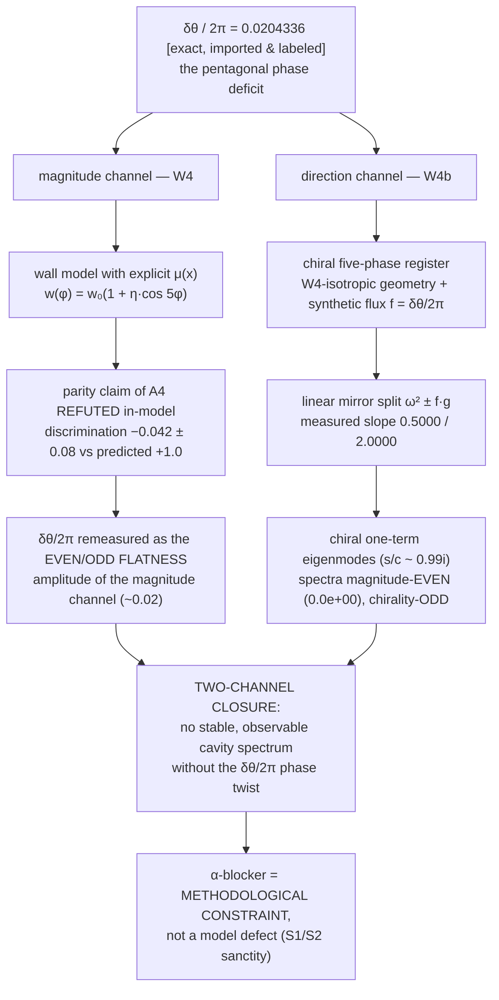

# SPUMA–LIMEN–Vault–CADENCE–CRG-Flux–VMC-QF Family — Home

> **One protocol, six repositories.** All six repos execute the same Aligned Protocol (canonical home: [LIMEN-VACUI `08_Protocol/Aligned-Protocol`](https://github.com/adelgachkar/LIMEN-VACUI)). This wiki is the family's front door: the closure map, the version table, and the fa/↔EN index.

---

## 1. The family at a glance

| Repository | Role | Version | Language layout | Zenodo (concept DOI) |
|---|---|---|---|---|
| **[LIMEN-VACUI](https://github.com/adelgachkar/LIMEN-VACUI)** | pre-boundary narrative; **canonical home of the Aligned Protocol**, the Two-Realm Register, and the Explanatory Closure | v0.12.3 | EN root + **fa/ full mirror** |  |
| **[SPUMA-VACUI](https://github.com/adelgachkar/SPUMA-VACUI)** | vacuum-foam narrative; K1 freeze-out physics, cavity harmonics, Companion-Bridge | v0.4.10 | EN only |  |
| **[Emergence-SDF-Vault](https://github.com/adelgachkar/Emergence-SDF-Vault)** | discrete-geometry emergence model; the source of derived constants (κ_hop, τ_d, δθ) | v30.3.11 | EN only |  |
| **[CADENCE-SDF](https://github.com/adelgachkar/CADENCE-SDF)** | engineering-facing axiom/CAD presentation; fail-closed governance (norm E2) | v3.6.9 | EN only |  |
| **[CRG-Flux](https://github.com/adelgachkar/CRG-Flux)** | cross-scale flexoelectric→cosmological vault; the family's laboratory-physics bridge (bent-graphene flexoelectricity); source of the W8 external-feeding test | v0.1.0 | EN only | *(pending — first deposit not yet published)* |
| **[VMC-QF](https://github.com/adelgachkar/VMC-QF)** | quantum-microcavity narrative: manifold-free quantum substrate (finite Hilbert space per node, discrete cadence time), topological soliton on the same 5-around-1 geometry (δθ imported-and-labeled from Vault); **Records Vault-11/12/13/14**: exact 64-dim CPTP execution (defect-doubles-lifetime ratios 2.042 / 2.083 at γ=0.1), R(γ) erosion map, scale battery, and the nonlinear-feedback battery that closed the last open criterion | v0.2.0 | EN only | *(pending — webhook not yet enabled)* |

*Versions as of 2026-09-30. The version table is mirrored in Vault README §2b. A concept DOI always resolves to the newest published version; per-version DOIs are listed in §6. VMC-QF is public and published at v0.2.0 (releases v0.1.0 + v0.2.0; 8 commits) — it joins the DOI chain once its Zenodo webhook is enabled.*

**Journal status (SPUMA-VACUI):** the manuscript *"SPUMA-VACUI: Emergence of Near-Homogeneous Polarized Cavities in a Vacuum-Foam Substrate via Dual Boundary Constraints"* was submitted to *International Journal of Theoretical Physics* (Springer) on 2026-09-28; after one Technical-Check round (single point: author byline), it was re-submitted on **2026-09-29 17:05** and is in Technical Check again — see the family's first **Publication-Register** (`SPUMA-VACUI/00_MOC/Publication-Register.md`) for the full dated timeline. No acceptance or endorsement is claimed.

---

## 2. The two-channel closure of the pentagonal node

The family's latest consolidated result: the pentagonal node's phase deficit **δθ = 7.356103°** (δθ/2π = **0.0204336**, imported-and-labeled from Vault; nature-side status **F3**) closes through **two independent in-model channels** — full document: [LIMEN `10_Reference/Explanatory-Closure`](https://github.com/adelgachkar/LIMEN-VACUI/blob/main/10_Reference/Explanatory-Closure.md) (FA+EN).

**What is claimed — and what is not.** The closure does *not* answer "why five tetrahedra?"; it establishes the in-model necessity: *no stable, observable cavity spectrum is complete without the δθ/2π twist* — its magnitude via W4, its parity via W4b. The α-blocker (no derivation from the pre-boundary) is recorded as a methodological asset, not a gap.

**The migration is now machine-readable (W4c, 2026-09-27):** the nature-side S→W migration of the imported constants is no longer a hope — `tools/limen_w4c_f3_migration.py` pre-commits the four acceptance checks in `tools/limen_w4c_f3_migration_ledger.json` **before** any aligned companion dataset arrives; a future migration is a checkable register edit anchored to that dataset's ledger.

---

## 3. Register bank status

Canonical home: [LIMEN `08_Protocol/Two-Realm-Register`](https://github.com/adelgachkar/LIMEN-VACUI/blob/main/08_Protocol/Two-Realm-Register.md) (FA+EN, with a live lock-snapshot table).

| Realm | Items | Status |
|---|---|---|
| **Work** | W1, W2, W3, W4, W4b, W5, W6, W7 | ✅ **8 done** (W5 closed the 4.6 energy-scale ratio: one operator κ(g), two clocks — no new scale) |
| **Work** | W4c — the F3 S→W migration gate | ✅ done: four acceptance checks (D1 split / D1b chirality / D2 flatness / D3 operator power) pre-committed in `_ledger.json` before any dataset; in-silico the pentagonal node passes all four, the isotropic control and a split-only mimic fail with named gates [sim] |
| **Work** | W8 — external feeding: the CRG bistable branches → unified register exits (OQ-C4-2, from CRG-Flux) | ✅ done 2026-09-28: the two stable branches **split the two exits** — melted branch → SPUMA freeze-out (B), frozen-core branch → LIMEN registration (A); 0/9 calibration flips; bistability re-measured at 0.37% (E4: mean 1.25 stable equilibria). **Bank 10 done / 0 pending.** |
| **Work (VMC-QF register)** | VMC-QF-Vault-11 — the exact 64-dim CPTP execution of the D05 protocol, incl. the pending decisive D04 edge-phase test | ✅ done 2026-09-30: lifetime ratio vs S-01 = **2.042** (site detuning) / **2.083** (edge-phase flux) at γ=0.1 — the "defect at least doubles the coherence lifetime" criterion **confirmed in-silico**; block==full verified to ~10⁻¹³; single-γ qualification registered [sim] |
| **Work (VMC-QF register)** | VMC-QF-Vault-12 — relative-stability map R(γ) = τ_life(defect)/τ_life(null) | ✅ done 2026-09-30: R erodes monotonically ≈2.1 → 1.65 across γ ∈ [0.01, 0.5]; the ×2 criterion survives to γ ≈ 0.3; power-law collapse model falsified; three estimator conventions agree [sim] |
| **Work (VMC-QF register)** | VMC-QF-Vault-13 — the four S04 scale-falsification criteria | ✅ done 2026-09-30: causality v_ratio = 0.40 ✓; A03 balance residue within δ_tol ✓; percolation ρ_c = 0.4075 ✓ (E4: superseded untraceable 0.382); lifetime-enhancement **open-pending-feedback-operator**; pinning engine-scope-negative [sim] |
| **Work (VMC-QF register)** | VMC-QF-Vault-14 — criterion 2 closed with the registered D01 §8 feedback operator | ✅ done 2026-09-30: R_τ > 1 dt-robust in **both** dt conventions; genuine macro gain χ_gen = **2.0 J**; near-threshold gain denominator-driven (micro collapse at χ_collapse = 0.14); **E4 qualifier:** the Vault-13 baseline R_τ(β=0) = 0.965 was beat-revival-inflated ×2.14 by the coarse piecewise dephasing — dt-converged baseline ≈ 2.06 (history not erased) [sim] |
| **Sanctity** | S1, S2 | 🔒 permanent — untouched |
| **Framework** | F1, F2 (banked work) / F3 (revere) | 🔓 open / 🔒 until aligned data — **the migration gate is now machine-readable (W4c)** |

---

## 4. fa/ ↔ EN index

| Repository | EN | FA | Notes |
|---|---|---|---|
| LIMEN-VACUI | root (canonical) | [`fa/`](https://github.com/adelgachkar/LIMEN-VACUI/tree/main/fa) — full mirror incl. Protocol, Register, Closure | `lang: en` / `lang: fa` in frontmatter |
| SPUMA-VACUI | root | — | EN-first edition |
| Emergence-SDF-Vault | root | — | EN-first edition |
| CADENCE-SDF | root | — | EN-first edition |
| CRG-Flux | root | — | EN-first edition |
| VMC-QF | root (14 notes + 00_MOC/Index) | — | EN-first edition |

**Mirror rule (LIMEN):** every canonical edit lands in both languages in one commit; the frontmatter `lang` field decides the canonical side for QA.

---

## 5. Protocol anchors

- The generative triad: **constraint (potential-maker) × silence (licensor) × event (direction-maker)** → norms E0–E5.
- Literature grounding: nine anchors ([LIMEN `09_Literature_Grounding/`](https://github.com/adelgachkar/LIMEN-VACUI/tree/main/09_Literature_Grounding)) — Spencer-Brown, Luhmann, Lakatos, Tarski, Kant, Russell, Grothendieck, Feynman, Noether.
- Rank-ladder vocabulary: [Vault `01_Foundations/Rank-Ladder-Glossary`](https://github.com/adelgachkar/Emergence-SDF-Vault/blob/main/01_Foundations/Rank-Ladder-Glossary.md).
- Emergence as a registry event: [LIMEN `10_Reference/Emergence-Balance-Reference`](https://github.com/adelgachkar/LIMEN-VACUI/blob/main/10_Reference/Emergence-Balance-Reference.md) (FA+EN).
- Protocol status: [LIMEN `10_Reference/Bank-Complete`](https://github.com/adelgachkar/LIMEN-VACUI/blob/main/10_Reference/Bank-Complete.md) (FA+EN) — the eight executed tests, the four E4 corrections, the open items as designed.
- f_c unit convention (family-wide): **f_c = κ[rad/s]/π** (Vault `Optical-Stepping-Synthetic-Gauge` §2.2.2); the κ[Hz]/π reading differs by exactly 2π and reproduces nothing registered; exact identity **f_c·τ_d = 1/2**.

---

## 6. Citing the family

The citation chain is closed and automatic: **commit → tag → GitHub Release → Zenodo deposit (open, MIT, author ORCID 0009-0006-7713-6004) → versioned DOI.** Every future Release mints its own version DOI with no manual step.

| Repository | Concept DOI (always latest version) | Version DOI of the currently published record |
|---|---|---|
| LIMEN-VACUI | [10.5281/zenodo.23006050](https://doi.org/10.5281/zenodo.23006050) | [10.5281/zenodo.23017333](https://doi.org/10.5281/zenodo.23017333) (v0.12.3) |
| SPUMA-VACUI | [10.5281/zenodo.23006052](https://doi.org/10.5281/zenodo.23006052) | [10.5281/zenodo.23017334](https://doi.org/10.5281/zenodo.23017334) (v0.4.10) |
| Emergence-SDF-Vault | [10.5281/zenodo.22834778](https://doi.org/10.5281/zenodo.22834778) | [10.5281/zenodo.23017337](https://doi.org/10.5281/zenodo.23017337) (v30.3.11) |
| CADENCE-SDF | [10.5281/zenodo.23006055](https://doi.org/10.5281/zenodo.23006055) | [10.5281/zenodo.23017338](https://doi.org/10.5281/zenodo.23017338) (v3.6.9) |
| CRG-Flux | — (pending) | — (pending — the Zenodo webhook was enabled after the last sync; the first deposit mints at the next release) |
| VMC-QF | — (pending) | — (pending — the Zenodo webhook is not yet enabled for the repo; once enabled, each NEW release mints a deposit — the planned next release starts the chain; v0.1.0/v0.2.0 back-fill is not guaranteed by the integration) |

*E4 honesty note: the version DOI in each row anchors the currently published record (v0.12.3 / v0.4.10 / v30.3.11 / v3.6.9 — all published 2026-09-28 with the verified author ORCID 0009-0006-7713-6004) and is registered in each repo's CITATION.cff and README. CRG-Flux and VMC-QF have no deposit yet — no DOI is claimed for either. Cite the concept DOI unless you need an exact frozen version.*

---

## 7. VMC-QF falsification chain (family newcomer, closed)

The sixth member closed its full falsification chain on 2026-09-30 — every registered criterion now carries a measured value under a stated engine convention (linear engine: Vault-13; linear + D01 §8 feedback operator: Vault-14):

| Chain level | Record | Result |
|---|---|---|
| Axiom / geometry | G01 (rebuild) | δθ = 2π − 5·arccos(1/3) = 7.356103° derived and machine-verified; the pre-existing draft formula (arccos(7/8)) was arithmetically wrong and is registered as corrected |
| Simulation | Vault-11 / Vault-12 | defect-doubles-lifetime confirmed at γ=0.1 (2.042 / 2.083); R(γ) erosion map — ×2 survives to γ ≈ 0.3 |
| Scale | Vault-13 / Vault-14 | causality ✓, balance ✓, percolation ρ_c = 0.4075 ✓; criterion 2 closed: genuine macro protection χ_gen = 2.0 J (dt-robust); Vault-13 baseline 0.965 carries an E4 dt-convention qualifier (dt-converged ≈ 2.06) |

Data and scripts live in [`VMC-QF/_data/`](https://github.com/adelgachkar/VMC-QF/tree/main/_data) with per-record CSV, figure, and full run log.

---

*This wiki is versioned in git (LIMEN-VACUI `wiki/`). Content labels follow the family honesty registry: [exact] / [measured] / [structural] / [model]; nature-side physics is F3-flagged.*
